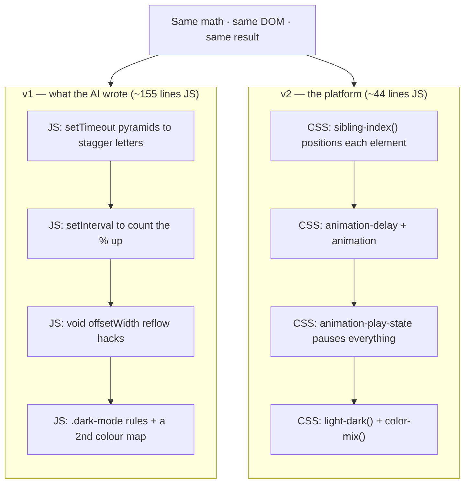

# LOVES Calculator — demo notes

The hero opener for the IO Extended 2026 talk. One algorithm, three eras: Pascal terminal, then the AI-built web version (v1), then the modern platform version (v2). Everything in this section builds to one point: the AI rebuilt the web app with techniques from 2019, and the 2026 browser does most of that work for free.

## The contrast (this is the thesis)

Same app, same animation, same result. The only thing that changes between v1 and v2 is who runs the timeline. v1 hand-codes every beat in JavaScript. v2 hands it to CSS and deletes the code.

**JS shrinks from 155 lines (v1) to 44 lines (v2).** Everything that disappeared moved into the browser. v2's JavaScript does two jobs only: the math, and building the markup. Every bit of *timing, theming, and shaping* lives in CSS.



| To do this... | v1 (what the AI wrote) | v2 (the platform) |
|---|---|---|
| Dark mode | `.dark-mode` overrides on every element + a JS toggle + a 2nd colour map | `light-dark(#fff0f5, #160d14)` |
| Stagger each letter | `setTimeout(fn, i*PHASE)` three deep, wrapped in an IIFE | `animation-delay: calc((sibling-index() - 1) * var(--phase))` |
| Cascade row by row | a `setTimeout` loop plus `void offsetWidth` to force reflow | `animation-delay: calc(var(--phase)*5 + (sibling-index()-1)*var(--gap))` |
| Tint a chip from one colour | hardcode `#f48fb1`, then a second value for dark | `color-mix(in oklab, var(--c) 20%, transparent)` |
| Shape the corners | `border-radius: 8px`, rounded and that's it | `corner-shape: scoop` (card), `bevel` (chips), `superellipse()` (inputs) |
| Count up to the result | `setInterval(…, 25)` ticking one digit at a time | `animation: rise .6s both` |
| Pause mid-animation to explain it | track every timer handle, clear each one, recompute the time left | `animation-play-state: paused` |

Say: Every cell on the left is something the browser now does for you on the right. The AI reached for the left because that's the web it was trained on.

### Three side-by-sides to show on screen

**Stagger the letters.** v1 schedules three timers per letter:

```js
for (var li = 0; li < LETTERS.length; li++) {
  (function (i) {
    setTimeout(function () { keySpans[i].classList.add('lit'); }, i * PHASE);
    setTimeout(function () { lightMatches(spansA, LETTERS[i], color); }, i * PHASE + 350);
    setTimeout(function () { /* drop count i */ }, i * PHASE + 600);
  })(li);
}
```

v2 lets each element read its own position:

```css
.ch.key {
  animation: glow .6s both;
  animation-delay: calc((sibling-index() - 1) * var(--phase));
}
```

**Pause everything.** v1 can't, as written. To add it you'd track every `setTimeout`/`setInterval` handle, clear them all, then recompute the remaining delay for each. v2 freezes the whole timeline with one rule, because every animation lives in CSS:

```css
#out.paused * { animation-play-state: paused; }
```
```js
out.classList.add('paused');   // one class freezes the entire show
```

**Theme it.** v1 keeps a parallel universe for dark mode:

```css
body.dark-mode { background: #222; color: #eee; }
body.dark-mode .container { background: #333; border-color: #555; }
```
```js
function toggleTheme() { document.body.classList.toggle('dark-mode'); }
var COLORS = { L: '#e8589b', /* …and a second copy of all five for dark */ };
```

v2 states each value once and the browser picks:

```css
--bg: light-dark(#fff0f5, #160d14);
--cL: light-dark(#e8589b, #ff7eb6);
```

## How the LOVES score works

Write `NAME1 + LOVES + NAME2`, count the letters L, O, V, E, S across the whole line, then keep summing adjacent pairs until one number remains. That's the match percentage.

The word "LOVES" itself always adds `[1,1,1,1,1]`, which reduces to 16. So 16 is the hard floor; no pairing scores below it. The final value is a Pascal's-triangle-weighted sum of the counts: `1·L + 4·O + 6·V + 4·E + 1·S`. V carries weight 6, so names rich in V, O, and E spike the score. Real names cap around 60%, and 80%+ is effectively impossible. (A fun aside for the room.)

### Verdict bands

| Score | Verdict |
|---|---|
| `> 45` | 💍 A match made in heaven |
| `35–45` | 👀 Ooh, there's potential |
| `25–34` | 😅 It's... complicated |
| `< 25` | 🫠 Friendzone, sorry |

## The three demos

Each era escalates the verdict, from friendzone to a near-match:

| Era | Couple | Score | Verdict |
|---|---|---|---|
| Console (Pascal) | Drake + Rihanna | 20% | 🫠 friendzone (the situationship — the verdict is accurate) |
| v1 (web, what the AI built) | Justin Bieber + Hailey Baldwin | 31% | 😅 complicated |
| v2 (2026 platform) | Justin Bieber + Selena Gomez | 43% | 👀 potential |

### The climax: retype the full legal names, live

At the v2 finale, type the full legal names to push Justin and Selena over the line:

| Names | Score | Verdict |
|---|---|---|
| Justin Bieber + Selena Gomez | 43% | 👀 potential |
| **Justin Drew Bieber + Selena Marie Gomez** | **51%** | 💍 **MATCH** |

Justin and Hailey only reach 43% even with full names, so the algorithm picks Selena. Different surnames (Bieber, Gomez) keep the match from looking rigged.

Say: Just their full names pushed them over the line. The detail you feed it changes everything. Same with your AI.

Two traps to avoid on stage:
- Skip "Hailey Rhode Bieber". The shared surname makes a high score look obviously rigged.
- Drake is Aubrey Drake Graham; Rihanna is Robyn Rihanna Fenty. Fun aside, but their full names still land at 32% (complicated), not a match.

## Stage flow: what you say and do

1. **Pascal era.** "I got my first computer and wrote this in Pascal." Run the terminal version (`node loves.js "Drake" "Rihanna"`). Ugly monospace, inverted-triangle funnel, but it works.
2. **Web era.** "Everything moved to the web, so I rebuilt it there. I asked an AI." Show v1. It works, and it's ~150 lines of JavaScript doing everything by hand.
3. **2026 version.** "Here's what the browser can actually do now." Show v2. Letters glow, numbers cascade, 43% potential, then retype the full names to hit 51% and the match.

### Stage controls (v2)

- One button cycles: Calculate love → ⏸ Pause → ▶ Resume → … → Replay ❤️.
- Editing either name resets to a fresh Calculate.
- The button is a fixed 60px tall, so the label swaps with zero layout shift.
- `sibling-index()` teaching beat: it resolves on the element that *uses* it, not the one that declares it. That's why the cascade animates the **row**, not the chips, to drop in row by row.

## How to close the LOVES section

As the card rebuilds, name these five out loud, in the order they appear:

1. `light-dark()` — one value per scheme, no JS toggle, no second colour map.
2. `corner-shape` — `scoop`, `bevel`, `squircle`, `superellipse()`, well past `border-radius`.
3. `color-mix()` — derive every tint from one base colour.
4. `sibling-index()` — each element knows its own position, so no `setTimeout` pyramids.
5. timing in CSS — `animation-delay` and `animation-play-state` instead of `setInterval` and reflow hacks.

Say: None of this is exotic. It's all shipping today. The AI didn't use it because it learned the web from a world where these didn't exist. The browser grew up faster than the models did. The job isn't to memorize 50 features. It's to know they exist, so you can point your tools at the right ones.

## Files

- `loves.js` — Pascal-era terminal version: `node loves.js "Name A" "Name B"`
- `loves.pas` — the original Pascal source
- `v1/index.html` — the AI-built web version (verbose JS)
- `v2/index.html` — the modern platform version
